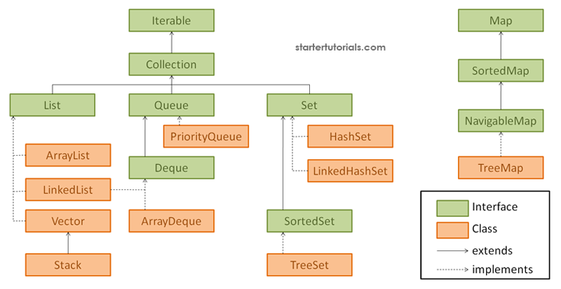

# 🧩 Java Collections Framework (JCF)

The **Java Collections Framework (JCF)** provides a unified architecture for storing, retrieving, and manipulating groups of objects.  
It includes interfaces, classes, and algorithms that make data management simple and efficient.

---

## 📘 Table of Contents
- [Overview](#overview)
- [Hierarchy Diagram](#hierarchy-diagram)
- [Key Interfaces](#key-interfaces)
- [Common Implementations](#common-implementations)
- [Examples](#examples)
  - [List](#1-list)
  - [Set](#2-set)
  - [Map](#3-map)
- [Comparable vs Comparator](#comparable-vs-comparator)
- [Summary Table](#summary-table)
- [References](#references)

---

## 🧠 Overview

Collections in Java are part of the `java.util` package and help in handling groups of data as single units (objects).  
They make data manipulation — like searching, sorting, insertion, and deletion — easier and faster.

### 🔹 Advantages
- Reduces programming effort.
- Improves performance and reusability.
- Provides ready-made data structures (List, Set, Map, etc.).
- Supports **Generics** for type safety.

---

## 🗂️ Hierarchy Diagram

Here’s the basic structure of the Collections Framework:



```

Collection (Interface)
├── List (Interface)
│    ├── ArrayList
│    ├── LinkedList
├── Set (Interface)
│    ├── HashSet
│    ├── TreeSet
└── Queue (Interface)
├── PriorityQueue

Map (Interface)
├── HashMap
├── TreeMap

````

---

## 🧩 Key Interfaces

| Interface | Description |
|------------|--------------|
| **Collection** | Root of the collection hierarchy. |
| **List** | Ordered collection, allows duplicates. |
| **Set** | Unordered collection, no duplicates. |
| **Queue** | Follows FIFO order (First-In-First-Out). |
| **Map** | Key-value pairs; keys are unique. |

---

## ⚙️ Common Implementations

| Interface | Class | Characteristics |
|------------|--------|----------------|
| List | `ArrayList`, `LinkedList` | Ordered, allows duplicates |
| Set | `HashSet`, `TreeSet` | No duplicates |
| Map | `HashMap`, `TreeMap` | Stores key-value pairs |
| Queue | `PriorityQueue`, `Deque` | Follows FIFO order |

---

## 💻 Examples

### 1️⃣ **List**
```java
import java.util.*;
public class ArrayListDemo {
    public static void main(String[] args) {
        ArrayList<String> languages = new ArrayList<>();
        languages.add("Java");
        languages.add("Python");
        languages.add("C++");

        System.out.println("Languages: " + languages);
        languages.remove("C++");
        languages.add(1, "R");
        System.out.println("Updated List: " + languages);
    }
}
````

---

### 2️⃣ **Set**

```java
import java.util.*;
public class HashSetDemo {
    public static void main(String[] args) {
        HashSet<Integer> set = new HashSet<>();
        set.add(10);
        set.add(20);
        set.add(10); // duplicate ignored

        for (int num : set)
            System.out.println(num);
    }
}
```

---

### 3️⃣ **Map**

```java
import java.util.*;
public class HashMapDemo {
    public static void main(String[] args) {
        HashMap<Integer, String> map = new HashMap<>();
        map.put(1, "Apple");
        map.put(2, "Banana");
        map.put(3, "Cherry");

        for (Integer key : map.keySet())
            System.out.println(key + " -> " + map.get(key));
    }
}
```

---

## 🧮 Comparable vs Comparator

| Feature  | Comparable      | Comparator     |
| -------- | --------------- | -------------- |
| Package  | `java.lang`     | `java.util`    |
| Method   | `compareTo()`   | `compare()`    |
| Use Case | Natural sorting | Custom sorting |

```java
import java.util.*;

class Student implements Comparable<Student> {
    int id;
    String name;
    Student(int id, String name) { this.id = id; this.name = name; }

    public int compareTo(Student s) {
        return name.compareTo(s.name);
    }
}

public class ComparableDemo {
    public static void main(String[] args) {
        ArrayList<Student> list = new ArrayList<>();
        list.add(new Student(3, "Riya"));
        list.add(new Student(1, "Amit"));
        list.add(new Student(2, "Karan"));

        Collections.sort(list);
        for (Student s : list)
            System.out.println(s.id + " " + s.name);
    }
}
```

---

## 🧾 Summary Table

| Interface | Implementation | Ordered?     | Duplicates? | Key-Value? |
| --------- | -------------- | ------------ | ----------- | ---------- |
| List      | ArrayList      | ✅ Yes        | ✅ Yes       | ❌ No       |
| Set       | HashSet        | ❌ No         | ❌ No        | ❌ No       |
| Map       | HashMap        | ❌ No         | ❌ (Keys)    | ✅ Yes      |
| Queue     | PriorityQueue  | ✅ Yes (FIFO) | ✅ Yes       | ❌ No       |

---
```
